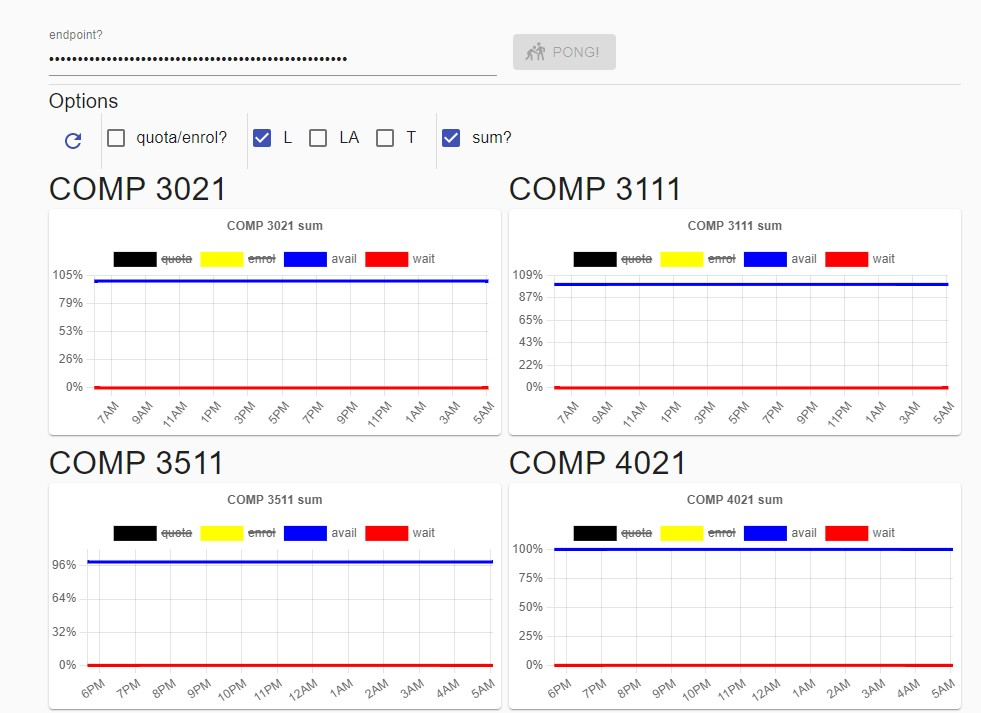

- frontend for ust quota viewer

- this website expected u to implement ur own backend with the following 2 apis

### GET /

req {}

resp {}

### GET /quotas

req { hour: number }

resp { quotas: { courseCode: string, section: string, t: number, quota, enrol, avail, wait: number }[] }
